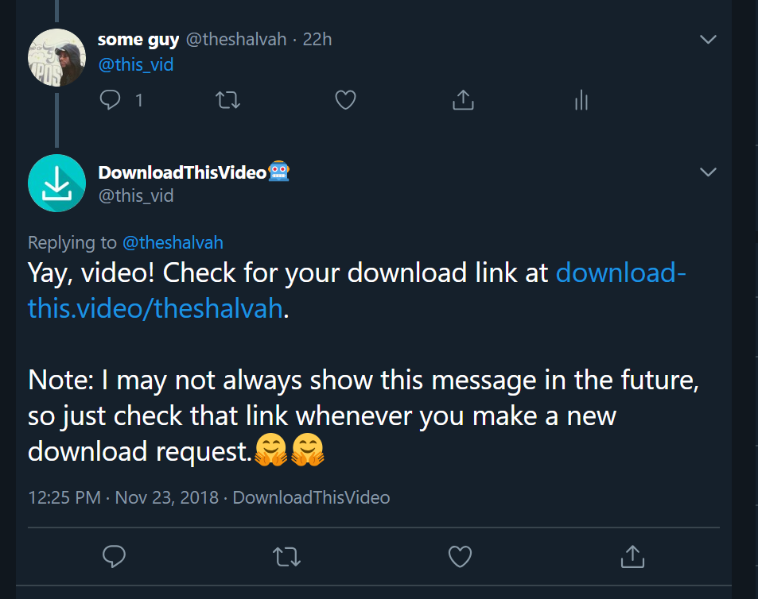

# DownloadThisVideo
Easily download videos/GIFs off Twitter. Mention the bot (@this_vid) in a reply to the tweet containing the video, and it'll reply with a download link in a few minutes.

## How this works
## Stack
- [AWS Lambda](https://aws.amazon.com/lambda/) with the [Serverless Framework](http://serverless.com)
- [AWS SNS](http://aws.amazon.com/sns)
- [Redis](http://redis.io)
- Node.js 8.10

### Implementation
The bot consists of several AWS Lambda functions that work in tandem:

#### fetchTweetsToDownload
This function runs every 4 minutes and checks for new mentions. It publishes these new mentions as a new notification on an SNS topic. The 4-minute interval is so as to not hit Twitter's rate limits and minimize AWS Lambda usage time, while being near-realtime.

#### sendDownloadLink
This is triggered by new notifications on the SNS topic. It:
- processes the tweets in the message body,
- calls Twitter's API to retrieve media links. Any video links retrieved for a tweet are stored in Redis for faster repeated access (other users requesting the same video).
- adds the download details to the user's store in Redis. The _user's store_ is an entry in Redis where all downloads requested by a user are cached for a certain period (48 hours).
- attempts to reply to the user with a link to the user's download page (see section below). "Attempts" because  Twitter enforces tweet limits (2400 per day, counted in 15-minute periods). If the API limits have been reached, the bot will "cool down" (not send any replies) for 10 minutes.

#### getDownloads
This is triggered by a HTTP request to the <AWS API Gateway URL>/<Twitter-handle> (for instance, http://download-this.video/jack). It renders a page showing a list of the user's recent downloads.

#### getHomePage
Renders the homepage 😁. See http://download-this.video.

#### retryFailedTasks
This re-publishes failed tasks (stored in Redis) as a new SNS message. For now, it can only be triggered manually.

# Development
- CLone the repo
- Run `npm install`.

That's pretty much it. Deployments can only be done by the maintainer, so depending on where you're contributing, you might have to develop "in the dark".

I should probably add a couple unit tests here and there. 🤔
